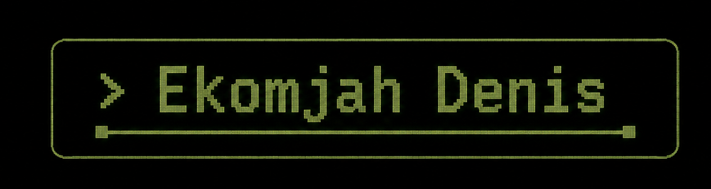

  

---

  <b>Full-Stack Developer</b> 
  Solving real problems • Designer  Undergraduate • Always learning

---

### Tech Stack & Skills

| **Programming Languages** | **Development** | **Tools** |
| :--- | :--- | :--- |
|  |  |  |

---

---  

## 🚀 Skills  
### Frontend  
- React  
- D3  
- Tailwind CSS  
- Webpack  
- Vite  

### Backend  
- FastAPI  
- Node.js  
- Express  
- PostgreSQL  

### Testing  
- Jest  
- Vitest  
- Pytest  

### Package Management  
- npm  
- pip  
- Yarn  

---  

## 🌟 Featured Projects  
- **Project A**: [Link to Project A]  
- **Project B**: [Link to Project B]  
- **Project C**: [Link to Project C]  

---  

## 📫 Contact Me  
- Email: [ekomjahedet@gmail.com](mailto:ekomjahedet@gmail.com)  
- X Account: [@ekz_dee](https://x.com/@ekz_dee)  

---  

**Feel free to connect with me!**  

  

*This README has been last updated on 2026-04-22 21:18:18 UTC*
